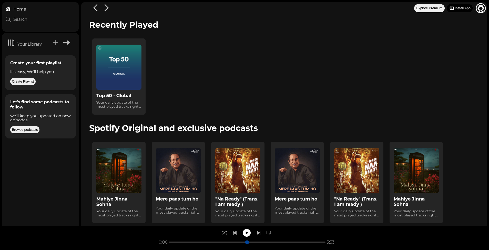

# Spotify Web Player UI Clone (HTML & CSS)🎵

A visually accurate clone of the Spotify web player built using only HTML and CSS.
This project focuses on recreating the user interface and layout of Spotify with attention to detail and responsiveness.

---

## :rocket: Live Preview

## &nbsp; &nbsp;&nbsp;&nbsp;&nbsp;&nbsp;&nbsp; :rocket:&nbsp; [Live Preview](https://5x30pm.github.io/spotify_clone)

---

## ✨ Features

- 🎧 Spotify-inspired UI design
- 📃 Sidebar navigation (Home, Search, Library)
- 🎵 Playlist layout
- 🎚 Music player bar (UI only)
- 📱 Responsive design
- 🎨 Clean and modern styling

---

## 🛠 Tech Stack

- HTML5
- CSS3 &nbsp;(Flexbox)

---

## 📸 Screenshots



---

## ⚙️ How to Run

1. Clone the repository

```bash
git clone https://github.com/5x30pm/spotify_clone.git
```

2. Open the project folder

```bash
cd spotify_clone
```

3. Open `index.html` in your browser

---

## 📚 What I Learned

- Building complex layouts using Flexbox and Grid
- Improving UI/UX design skills
- Structuring clean and maintainable HTML/CSS
- Practicing real-world UI cloning
- oveflow:hidden,auto;

```CSS
overflow: hidden;
overflow:auto;
```

- width: fit-content/100% - 20px;

```CSS
width:fit-content;
width:100% - 20px;
```

- position:sticky;

```css
position: sticky;
```

- z-index:10;

```css
z-index: 10;
```

- appearance:none/auto;

```css
appearance: none;
appearance: auto;
```

---

## 🚧 Limitations

- No music playback functionality
- No JavaScript used
- Static UI only

---

## 🔮 Future Improvements

- Add JavaScript for interactivity
- Implement music playback controls
- Add animations and transitions
- Improve responsiveness further

---

## 👨‍💻 Author

- [GitHub](https://github.com/5x30pm)
- [Linkedin](https://www.linkedin.com/in/user-5x30pm)
- [Email](mailto:5x30pm@proton.me)
- [Telegram](https://t.me/user_5x30pm)

---
<p align="right" >Thanks for visiting Spotify_clone Repo &hearts;</p>
